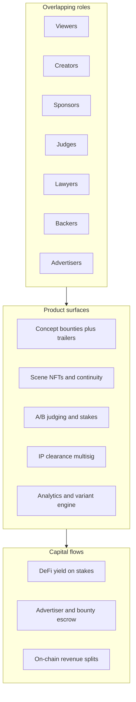

# SnapCinema Studio deep dive and project comparison

## 1. What SnapCinema Studio actually is (compressed)

SnapCinema Studio bundles **eight** product categories into one system:

- **Crowdfunded film production** (sponsors, backers, bounties)
- **UGC + NFT minting** (scenes as cNFTs with continuity metadata)
- **Prediction / staking markets on creative outcomes** (judges stake on A/B winners)
- **Professional services marketplace** (IP lawyers, multi-sig clearance)
- **Performance marketing / bounties** (advertisers, verified views, escrow)
- **Subscription + streaming economics** reimagined as **yield sacrifice** (not fiat)
- **Personalization / recommender** (clusters, variant assembly)
- **Treasury + DAO-style governance** (fees, grants, proposals)

**No native token** is claimed; revenue is **fees, yield skim, facilitation**—which is coherent but shifts complexity into **native SOL**, DeFi integrations, and legal treatment of “staking for access.”

---

## 2. Strengths (why investors and judges might care)

| Dimension                   | Why it resonates                                                                                                                                                                                                                                                                  |
| --------------------------- | --------------------------------------------------------------------------------------------------------------------------------------------------------------------------------------------------------------------------------------------------------------------------------- |
| **Narrative**               | Clear “decentralized studio” story; roles map to known crypto primitives (bounties, escrow, splits, staking).                                                                                                                                                                     |
| **TAM / vision**            | Large if framed as **data + tooling + coordination** for entertainment, not “one indie film app.”                                                                                                                                                                                 |
| **Why Solana**              | High-throughput event log, cheap txs, NFT + native **SOL** / ecosystem fit **if** you keep on-chain scope disciplined.                                                                                                                                                                        |
| **No token (stated)**       | Avoids reflexive “token dump” skepticism; forces real revenue model thinking—**in pitch** this is a plus.                                                                                                                                                                         |
| **Synergy with SnapCinema** | Your existing direction (`[docs/PRODUCT-AND-PLAN.md](docs/PRODUCT-AND-PLAN.md)`) is **scene generation and pipeline**; SnapCinema Studio positions **downstream**: selection, economics, canon—**conceptually consistent** with “SnapCinema produces units; protocol coordinates canon.” |

---

## 3. Risks and gaps (technical, legal, product)

### 3a. Scope and coupling

Delivering **all** roles and revenue lines in one release is **not** a hackathon-scale project; it is a **multi-year platform portfolio**. The design **assumes** mature integrations: **Kamino/Marginfi**, **Metaplex**, **Livepeer/Theta**, **IPFS/Arweave**, **fraud-resistant view metrics**, **lawyer multi-sig workflows**—each is a product.

**Failure mode:** “Fully overlapping roles” sounds inclusive but **increases** cold-start and UX complexity; most successful launches **sequence** roles (e.g. sponsors + creators before advertisers + lawyers).

### 3b. “Stake crypto for streaming access (sacrificing yield)” vs **judge yield to treasury**

- **Viewer / streaming** yield-for-access is a distinct **consumer** narrative from **Phase A StakeToCurate** (on-chain **curation stakes** + **revenue split** to curators/creators). Phase A scope is in [`sceneforge-phase-a.md`](sceneforge-phase-a.md) and [`project-description.md`](project-description.md).
- **Regulatory:** Marketing **staking yield** to consumers as **access to media** may be read as **securities**, **gambling-adjacent**, or **consumer financial product** in multiple jurisdictions—not legal advice, but **investors will ask** for a compliance path.
- **Product:** Users must understand **opportunity cost vs subscription**; support burden is high.
- **Technical:** Yield from pooled stakes implies **custody or routing architecture** and **smart contract risk**—“no native token” does not mean “no regulatory surface.”

### 3c. Advertisers and “verified paid views”

- **Off-chain truth:** View counts require **platform or oracle trust**; advertisers historically **dispute** metrics. On-chain escrow only works if **dispute rules** are crisp.
- **Brand safety:** Coca-Cola-style placement + UGC is **reputation risk** for brands unless **editorial control** is strong.

### 3d. IP lawyers on-chain

- **Liability:** Lawyers **signing off** on UGC can create **professional responsibility** and **platform liability** questions; **peer multi-sig** does not replace **licensing** from rights holders.
- **Scale:** Human review **does not scale** to TikTok-like volume; you need **tiered** triage (AI + escalation).

### 3e. Judges stake on A/B outcomes

- Overlaps **prediction markets** and **wagering** regimes depending on framing; also **plutocracy** if stake weight dominates—same class of issues discussed in your Colosseum crowd-movie analysis.

### 3f. Analytics and personalized variants

- **Strong moat** if you own data and **consent**—but **“every prompt on-chain”** is expensive and may **conflict with privacy** expectations; hybrid **hashes + off-chain encrypted store** is more realistic.
- **Variant assembly** from a scene pool is **non-trivial editorial + ML**; “automatically assembles coherent films” is **research-grade**, not an MVP checkbox.

### 3g. Self-sustaining without external funding

- **Yield skim** scales with **TVL** under your routing; early **TVL is tiny** → **treasury is tiny**. The model **eventually** works only if **usage** drives **stake volume**—same cold-start as any DeFi consumer app.

---

## 4. Feasible sequencing (if you build SnapCinema Studio for real)

A realistic path is **not** the full whitepaper in v1:

1. **Phase A — StakeToCurate + demo:** **SOL**-only **proof-of-curation** primitive (**stake_up/down**, rank-weighted version exposure, **deposit_revenue**, **20/10/70** split, curator **claims**); thin **evolving live-stream** vertical. **No** advertisers, **no** lawyer workflow (see [`project-description.md`](project-description.md)).
2. **Phase B — Backers / sponsors:** Escrow for **project funding**, clearer **securities-aware** structuring (often **off-chain legal entity** + on-chain settlement).
3. **Phase C — Advertisers:** After **measurement** and **brand controls** exist.
4. **Phase D — Yield-for-access:** Only after **legal** and **UX** clarity; possibly **never** in some markets—substitute **plain subscription** (fiat or SOL-denominated) where needed.
5. **Phase E — Dataset / AI moat:** After **volume** and **rights** to train.

**SnapCinema Studio as written** is closest to **Phase E vision** with **Phase A** still missing in the spec’s level of detail for **one** closed loop.

---

## 5. Hackathon vs accelerator fit (SnapCinema Studio vs your other lines)

Interpretation: **“other listed projects”** = **SnapCinema** (`[README.md](README.md)`, `[docs/PRODUCT-AND-PLAN.md](docs/PRODUCT-AND-PLAN.md)`), **oracle / price-based vesting** (`[docs/colosseum-hackathon-brief.md](docs/colosseum-hackathon-brief.md)` Lead A), and **narrower CrowdCinema** (vote + split + scene integration without the full SnapCinema Studio stack).

| Criterion                               | SnapCinema Studio (full vision)                                                      | Narrow CrowdCinema (vote + split + scene feed)                  | SnapCinema (current repo focus)                                                  | Price-based vesting (Lead A)                                                     |
| --------------------------------------- | ----------------------------------------------------------------------------- | --------------------------------------------------------------- | -------------------------------------------------------------------------------- | -------------------------------------------------------------------------------- |
| **Hackathon win probability**           | **Low** if judged on shipping **breadth**—too many systems for a short window | **High** if scope is **one program + one UX loop**              | **Medium**—working site helps, but **crypto story is thin** unless you add chain | **High**—small, clear **on-chain demo**                                          |
| **Demo clarity for judges**             | **Risk of “story deck, thin product”** unless ruthlessly cut                  | **Strong**—**submit → select → pay** is legible                 | **Strong** for **product**, weaker for **Solana thesis**                         | **Very strong** for **Solana primitive**                                         |
| **Accelerator / large-check narrative** | **Very high ceiling**—coordination, data, entertainment TAM                   | **High**—protocol + creator economy, **if** IP path is credible | **Medium**—incumbent-heavy **unless** wedge is sharp                             | **Low** as **standalone**—**TAM / Streamflow-class overlap** you already flagged |

**Reconciling your strategy:** You previously concluded **CrowdCinema** is the better **accelerator story** and **chain rationale**; **SnapCinema Studio is CrowdCinema + many adjacent businesses**. For **funding**, the **ceiling** of SnapCinema Studio is **higher** than vesting alone; for **probability of execution**, the **full SnapCinema Studio** is **lower** than a **single-loop CrowdCinema** unless you **explicitly** scope the v1.

---

## 6. Direct answer: “chance of winning hackathon or accelerator”

- **Hackathon:** **Full SnapCinema Studio** is **unlikely to win on shipped breadth** versus a **narrow** Anchor program + UI. **Winning** usually requires **one** unforgettable **on-chain** path. **Recommendation:** Pitch SnapCinema Studio in the **deck**; **build** **Phase A** only (same as a **minimal CrowdCinema**).
- **Accelerator:** **SnapCinema Studio’s** story is **strong enough** to **earn a meeting** if **de-risked** (legal, one vertical, path to data). **Full simultaneous** launch of **yield-for-access + lawyers + advertisers + personalization** **hurts** credibility versus **sequenced** milestones.

**Versus SnapCinema alone:** SnapCinema Studio (or narrow CrowdCinema) **wins on “why crypto”** and **venture ceiling**; SnapCinema **wins on** existing **product surface** and **shipping**—**best combined** as **SnapCinema → scene output**, **SnapCinema Studio/CrowdCinema → economics and canon**.

**Versus vesting:** **Vesting** **wins hackathon demo** simplicity; **SnapCinema Studio/CrowdCinema** **wins accelerator TAM** if execution is believed; **vesting loses** as a **solo** accelerator company **unless** expanded.

---

## 7. Summary judgment

SnapCinema Studio is a **credible long-term vision document** and a **risky single-scope hackathon submission**. Treat it as **north star**; ship **one** **closed loop** that **instances** a **subset** of roles (e.g. sponsor + creator + judge **or** creator + judge + split). That subset is **your** “CrowdCinema” MVP; **SnapCinema Studio** is the **name for the full stack** once phases land.

No codebase changes are implied by this analysis; it is strategy-only.